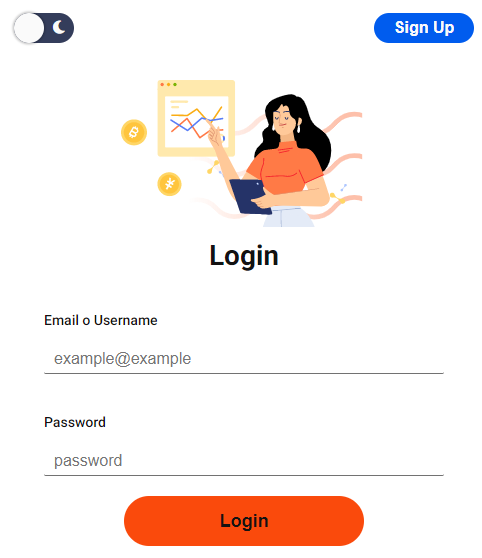
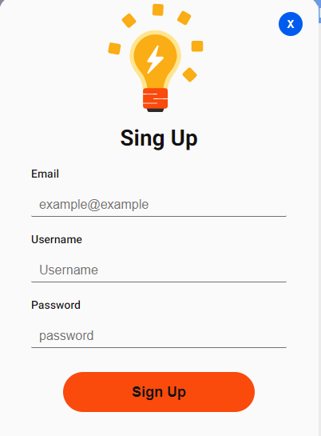
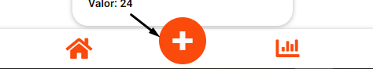
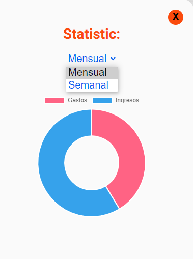

# My Wallet

My wallet is a web app that allows you to track your personal finances. where you can enter your income and expenses in addition to being able to categorize them to better control your finances. In addition to being able to carry a comparative graph of your expenses vs revenue, and have on your dashboard the total money in favor or find if that is the case.

## How to use the web app

### Home

- 

- Sign up with your preferred email and password.
  

- On your dashboard in the plus inco you add your revenues or expenses.
  

- On the chart icon you can validate your chart by week or month.
  

### Deployment link

- https://master-wallet.netlify.app/

### Used technologies

- HTML
- CSS
- JavaScript
- npm
- Sass

### link to the repository

- https://bitbucket.org/leobotache7/my-wallet/src/main/
